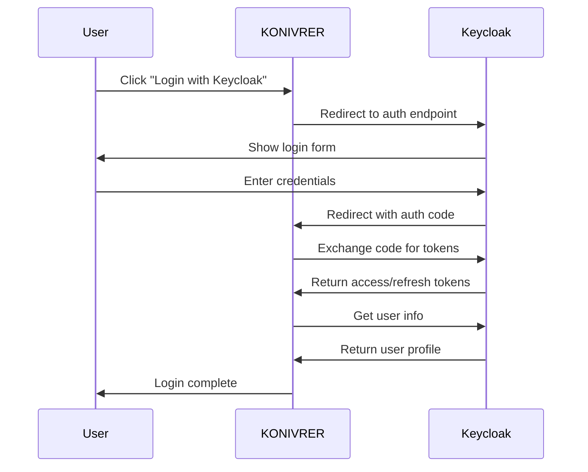

# 🔐 KONIVRER Keycloak Integration

## Overview

This document provides a complete guide for integrating Keycloak with the KONIVRER gaming platform. Keycloak provides enterprise-grade identity and access management with features like single sign-on, role-based access control, and centralized user management.

## 🚀 Quick Start

### 1. Start Keycloak with Docker Compose

```bash
# Start Keycloak and PostgreSQL
docker-compose -f docker-compose.keycloak.yml up -d

# Wait for services to be ready (about 2-3 minutes)
docker-compose -f docker-compose.keycloak.yml logs -f keycloak
```

### 2. Automatic Setup (Recommended)

The realm configuration is automatically imported on startup. Access:

- **Keycloak Admin Console**: http://localhost:8080/admin
- **Username**: `admin`
- **Password**: `admin`

### 3. Manual Setup (Alternative)

If automatic import fails, run the setup script:

```bash
# Run setup script inside Keycloak container
docker-compose -f docker-compose.keycloak.yml exec keycloak /scripts/setup-keycloak.sh
```

### 4. Configure Environment

Update your `.env` file:

```env
REACT_APP_KEYCLOAK_URL=http://localhost:8080
REACT_APP_KEYCLOAK_REALM=konivrer
REACT_APP_KEYCLOAK_CLIENT_ID=konivrer-app
REACT_APP_KEYCLOAK_CLIENT_SECRET=konivrer-client-secret-change-in-production
```

### 5. Start KONIVRER Application

```bash
npm start
```

## 👥 Demo Users

The setup includes three demo users for testing:

| Username | Password | Roles | Description |
|----------|----------|-------|-------------|
| `demo` | `demo123` | user, deck-builder | Basic user with deck building |
| `konivrer-admin` | `admin123` | All roles | Full administrative access |
| `premium` | `premium123` | user, premium, deck-builder | Premium user features |

## 🏗️ Architecture

### Components

1. **SSOService** (`src/services/ssoService.ts`)
   - Handles OAuth 2.0 / OpenID Connect flows
   - Manages multiple SSO providers including Keycloak
   - Token management and validation

2. **KeycloakService** (`src/services/keycloakService.ts`)
   - Keycloak-specific functionality
   - Token validation and refresh
   - Role and group management
   - Advanced security features

3. **RoleBasedAccess** (`src/components/RoleBasedAccess.tsx`)
   - React components for role-based UI
   - Higher-order components for access control
   - Hooks for role checking

4. **KeycloakDemo** (`src/components/KeycloakDemo.tsx`)
   - Interactive demo of Keycloak features
   - Role-based access examples
   - Token validation showcase

### Authentication Flow



## 🔒 Security Features

### Token Management

- **Access Token**: Short-lived (5 minutes) for API access
- **Refresh Token**: Long-lived (30 days) for token renewal
- **ID Token**: Contains user identity information
- **Automatic Refresh**: Tokens refreshed before expiration

### Role-Based Access Control

```typescript
// Check single role
const { hasRole } = useRoleAccess();
if (hasRole('admin')) {
  // Show admin features
}

// Check multiple roles
const { hasAnyRole } = useRoleAccess();
if (hasAnyRole(['admin', 'moderator'])) {
  // Show staff features
}

// Component-based access control
<AdminAccess>
  <AdminPanel />
</AdminAccess>
```

### Available Roles

- `user` - Basic authenticated user
- `premium` - Access to premium features
- `deck-builder` - Can create and share decks
- `tournament-organizer` - Can manage tournaments
- `moderator` - Content moderation privileges
- `admin` - Administrative access
- `super-admin` - Full system administration

## 🔧 Configuration

### Realm Configuration

The KONIVRER realm includes:

- **Client**: `konivrer-app` (OpenID Connect)
- **Roles**: Predefined gaming platform roles
- **Groups**: User organization and role assignment
- **Users**: Demo users for testing
- **Security**: Brute force protection, password policies

### Client Settings

```json
{
  "clientId": "konivrer-app",
  "protocol": "openid-connect",
  "redirectUris": [
    "http://localhost:3000/auth/callback/keycloak",
    "https://yourdomain.com/auth/callback/keycloak"
  ],
  "webOrigins": [
    "http://localhost:3000",
    "https://yourdomain.com"
  ]
}
```

### Token Mappers

- **Username**: Maps to `preferred_username`
- **Email**: Maps to `email`
- **Name**: Maps to `given_name` and `family_name`
- **Roles**: Maps realm roles to `realm_access.roles`
- **Groups**: Maps user groups to `groups`

## 🛠️ Development

### Local Development

1. **Start Keycloak**:
   ```bash
   docker-compose -f docker-compose.keycloak.yml up -d
   ```

2. **Development Mode**: The SSO service automatically detects development mode and provides simulated authentication for testing without a running Keycloak instance.

3. **Debug Mode**: Enable debug logging:
   ```typescript
   const DEBUG = process.env.NODE_ENV === 'development';
   ```

### Testing

```typescript
import { useRoleAccess } from '../components/RoleBasedAccess';

function TestComponent() {
  const { user, hasRole, isKeycloakUser } = useRoleAccess();
  
  return (
    <div>
      <p>User: {user?.name}</p>
      <p>Is Keycloak User: {isKeycloakUser ? 'Yes' : 'No'}</p>
      <p>Is Admin: {hasRole('admin') ? 'Yes' : 'No'}</p>
    </div>
  );
}
```

### Custom Roles

Add new roles in Keycloak Admin Console:

1. Go to "Realm roles"
2. Click "Create role"
3. Set name and description
4. Assign to users or groups

Update role checks in code:

```typescript
// Add new role check
const { hasRole } = useRoleAccess();
if (hasRole('custom-role')) {
  // Custom functionality
}
```

## 🚀 Production Deployment

### Environment Variables

```env
# Production Keycloak
REACT_APP_KEYCLOAK_URL=https://auth.yourdomain.com
REACT_APP_KEYCLOAK_REALM=konivrer
REACT_APP_KEYCLOAK_CLIENT_ID=konivrer-app
REACT_APP_KEYCLOAK_CLIENT_SECRET=your-production-secret

# Database
KEYCLOAK_DB_PASSWORD=secure-db-password
KEYCLOAK_ADMIN_PASSWORD=secure-admin-password
```

### SSL/TLS Configuration

1. **Generate Certificates**:
   ```bash
   # Let's Encrypt
   certbot certonly --standalone -d auth.yourdomain.com
   
   # Copy certificates
   cp /etc/letsencrypt/live/auth.yourdomain.com/fullchain.pem ./certs/server.crt.pem
   cp /etc/letsencrypt/live/auth.yourdomain.com/privkey.pem ./certs/server.key.pem
   ```

2. **Update Docker Compose**:
   ```yaml
   keycloak:
     environment:
       KC_HTTPS_CERTIFICATE_FILE: /opt/keycloak/conf/server.crt.pem
       KC_HTTPS_CERTIFICATE_KEY_FILE: /opt/keycloak/conf/server.key.pem
       KC_HOSTNAME: auth.yourdomain.com
     ports:
       - "8443:8443"
   ```

### High Availability

For production, consider:

- **Database Clustering**: PostgreSQL with replication
- **Keycloak Clustering**: Multiple Keycloak instances
- **Load Balancing**: Nginx or HAProxy
- **Monitoring**: Prometheus and Grafana

## 📊 Monitoring

### Health Checks

```bash
# Keycloak health
curl http://localhost:8080/health

# Realm health
curl http://localhost:8080/realms/konivrer/.well-known/openid_configuration
```

### Metrics

Keycloak provides metrics endpoints:

```bash
# Enable metrics in Keycloak
KC_METRICS_ENABLED=true

# Access metrics
curl http://localhost:8080/realms/konivrer/metrics
```

### Event Logging

Enable event logging in Keycloak Admin Console:

1. Go to "Realm settings" → "Events"
2. Enable "Save events"
3. Configure event types to log

## 🔍 Troubleshooting

### Common Issues

1. **CORS Errors**
   - Check "Web origins" in client settings
   - Ensure correct redirect URIs

2. **Token Validation Fails**
   - Verify client secret
   - Check token expiration
   - Validate issuer URL

3. **Role Assignment Issues**
   - Check user role mappings
   - Verify client scope configuration
   - Ensure role mappers are configured

### Debug Commands

```bash
# Check Keycloak logs
docker-compose -f docker-compose.keycloak.yml logs keycloak

# Check PostgreSQL connection
docker-compose -f docker-compose.keycloak.yml exec postgres psql -U keycloak -d keycloak -c "\dt"

# Test token endpoint
curl -X POST http://localhost:8080/realms/konivrer/protocol/openid-connect/token \
  -d "grant_type=password" \
  -d "client_id=konivrer-app" \
  -d "username=demo" \
  -d "password=demo123"
```

### Reset and Cleanup

```bash
# Stop and remove containers
docker-compose -f docker-compose.keycloak.yml down

# Remove volumes (WARNING: This deletes all data)
docker-compose -f docker-compose.keycloak.yml down -v

# Restart fresh
docker-compose -f docker-compose.keycloak.yml up -d
```

## 📚 Additional Resources

- [Keycloak Documentation](https://www.keycloak.org/documentation)
- [OpenID Connect Specification](https://openid.net/connect/)
- [OAuth 2.0 Specification](https://oauth.net/2/)
- [Keycloak REST API](https://www.keycloak.org/docs-api/)

## 🤝 Contributing

To contribute to the Keycloak integration:

1. Fork the repository
2. Create a feature branch
3. Make your changes
4. Test with the demo users
5. Submit a pull request

## 📄 License

This Keycloak integration is part of the KONIVRER project and follows the same license terms.

---

## 📝 Summary

The KONIVRER Keycloak integration provides:

- ✅ **Enterprise SSO**: Full OpenID Connect integration
- ✅ **Role-Based Access**: Granular permission system
- ✅ **Easy Setup**: Docker Compose and automated configuration
- ✅ **Demo Users**: Ready-to-test user accounts
- ✅ **Production Ready**: SSL/TLS and clustering support
- ✅ **Developer Friendly**: React hooks and components
- ✅ **Comprehensive Docs**: Setup guides and troubleshooting

For questions or support, refer to the troubleshooting section or open an issue in the repository.