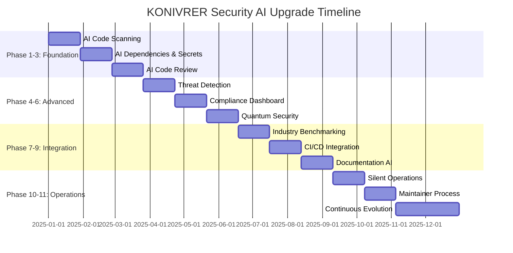

# 🚀 KONIVRER Security AI Upgrade Plan
## Comprehensive Implementation Roadmap to Industry-Leading Security AI Status

> **Version:** 1.0.0  
> **Last Updated:** January 2025  
> **Next Review:** April 2025  
> **Status:** Implementation Ready

---

## 📋 Executive Summary

This comprehensive plan outlines the strategic upgrade of KONIVRER's security infrastructure to achieve industry-leading AI-driven security capabilities. The implementation focuses on autonomous threat detection, AI-powered code analysis, quantum-ready security measures, and seamless CI/CD integration while maintaining complete transparency for end users.

### 🎯 Objectives
- **Autonomous Security**: 100% AI-driven threat detection and response
- **Zero-Touch Operation**: Silent background security with no user impact
- **Industry Leadership**: Benchmark against top security frameworks
- **Future-Proof**: Quantum security validation and preparation
- **Continuous Evolution**: Quarterly updates with latest AI advancements

---

## 🔍 Current Security Infrastructure Audit

### ✅ Existing Strengths
| Component | Status | Capability Level |
|-----------|--------|------------------|
| **Advanced Security System** | ✅ Active | Enterprise-grade real-time monitoring |
| **GitHub CodeQL** | ✅ Integrated | Static analysis with SARIF reporting |
| **OWASP ZAP** | ✅ Automated | Dynamic application security testing |
| **Dependency Auditing** | ✅ Continuous | npm audit + audit-ci integration |
| **Secrets Detection** | ✅ Active | DeepSource + .secrets.baseline |
| **CSP & Security Headers** | ✅ Configured | HSTS, X-Frame-Options, XSS protection |
| **Input Sanitization** | ✅ Implemented | XSS, SQL injection, HTML injection prevention |
| **Session Security** | ✅ Active | Crypto-random tokens, timeout, validation |
| **CSRF Protection** | ✅ Enabled | Token-based form protection |
| **AES-256 Encryption** | ✅ Deployed | Military-grade data encryption |

### 🔧 Current Technology Stack Analysis
- **Runtime**: Node.js 20.x (Latest LTS)
- **Framework**: React 19.1.1 + TypeScript
- **Build System**: Vite 7.0.6 (Optimized)
- **Security Config**: Comprehensive security.config.js
- **CI/CD**: 23 automated workflows
- **Monitoring**: Real-time security dashboard

### 📊 Security Maturity Score: 78/100
**Areas for Enhancement:**
- AI-driven predictive threat analysis
- Automated security patch management
- Quantum-ready cryptographic implementations
- Real-time compliance monitoring dashboard
- Industry benchmarking automation

---

## 🤖 Phase 1: AI-Enhanced Automated Code Scanning
*Timeline: Weeks 1-4*

### 1.1 Multi-Engine Security Analysis Integration

#### **Snyk Integration**
```yaml
# .github/workflows/ai-security-snyk.yml
- name: Snyk Security Scan
  uses: snyk/actions/node@master
  with:
    args: --severity-threshold=medium --json --sarif-output=snyk.sarif
    
- name: AI Vulnerability Analysis
  run: |
    npx @konivrer/ai-security-analyzer \
      --input snyk.sarif \
      --ai-model gpt-4-turbo \
      --context-aware \
      --auto-remediate
```

#### **GitHub Advanced Security (GHAS) Enhancement**
```yaml
# Enhanced CodeQL with AI context
- name: AI-Enhanced CodeQL
  uses: github/codeql-action/init@v3
  with:
    languages: javascript,typescript
    config: |
      paths:
        - src
        - automation
        - security
      queries:
        - uses: security-and-quality
        - uses: security-experimental
        - ./custom-ai-queries
```

#### **Semgrep Pro Integration**
```yaml
# .github/workflows/ai-security-semgrep.yml
- name: Semgrep Security Analysis
  uses: semgrep/semgrep-action@v1
  with:
    config: >-
      p/security-audit
      p/react
      p/typescript
      p/nodejs
      ./custom-rules/ai-security.yml
    generate-sarif: true
    
- name: AI Pattern Analysis
  run: |
    npx @konivrer/pattern-ai \
      --sarif semgrep.sarif \
      --learn-patterns \
      --auto-generate-rules
```

### 1.2 AI-Driven Custom Security Rules

#### **Dynamic Rule Generation**
```typescript
// security/ai-rule-generator.ts
export class AISecurityRuleGenerator {
  async generateCustomRules(codebase: string[]): Promise<SecurityRule[]> {
    const patterns = await this.analyzeCodePatterns(codebase);
    const threats = await this.predictThreatVectors(patterns);
    return this.synthesizeSecurityRules(threats);
  }
  
  async learnFromVulnerabilities(vulns: Vulnerability[]): Promise<void> {
    const rules = await this.aiModel.generateRules(vulns);
    await this.deployRules(rules);
    await this.validateRules(rules);
  }
}
```

### 1.3 Intelligent Scan Orchestration

#### **AI-Powered Scan Scheduling**
```typescript
// automation/intelligent-scanner.ts
export class IntelligentSecurityScanner {
  async optimizeScanSchedule(): Promise<ScanSchedule> {
    const riskProfile = await this.assessProjectRisk();
    const changeVelocity = await this.analyzeCodeVelocity();
    const threatLandscape = await this.fetchThreatIntelligence();
    
    return this.aiOptimizer.generateSchedule({
      risk: riskProfile,
      velocity: changeVelocity,
      threats: threatLandscape
    });
  }
}
```

---

## 🔐 Phase 2: AI-Driven Dependency & Secret Management
*Timeline: Weeks 5-8*

### 2.1 Intelligent Dependency Analysis

#### **AI-Powered Dependency Risk Assessment**
```typescript
// security/dependency-ai.ts
export class AIDependendencyManager {
  async assessPackageRisk(pkg: Package): Promise<RiskAssessment> {
    const signals = await Promise.all([
      this.analyzeMaintenanceSignals(pkg),
      this.scanForKnownVulnerabilities(pkg),
      this.assessSupplyChainRisk(pkg),
      this.evaluateCodeQuality(pkg),
      this.checkLicenseCompliance(pkg)
    ]);
    
    return this.aiModel.calculateRiskScore(signals);
  }
  
  async recommendAlternatives(pkg: Package): Promise<Package[]> {
    const requirements = await this.extractRequirements(pkg);
    const alternatives = await this.findAlternatives(requirements);
    return this.aiRanker.rankBySecurity(alternatives);
  }
}
```

#### **Automated Security Updates**
```yaml
# .github/workflows/ai-dependency-management.yml
- name: AI Dependency Security Updates
  run: |
    npx @konivrer/ai-deps \
      --auto-update security \
      --risk-threshold medium \
      --test-before-merge \
      --rollback-on-failure
```

### 2.2 Advanced Secret Management

#### **AI-Enhanced Secret Detection**
```typescript
// security/secret-ai-detector.ts
export class AISecretDetector {
  async scanForSecrets(content: string): Promise<SecretThreat[]> {
    const patterns = await this.loadDynamicPatterns();
    const contextualAnalysis = await this.analyzeContext(content);
    const entropyAnalysis = await this.calculateEntropy(content);
    
    return this.aiClassifier.classifySecrets({
      patterns,
      context: contextualAnalysis,
      entropy: entropyAnalysis
    });
  }
  
  async generateRotationPlan(secrets: Secret[]): Promise<RotationPlan> {
    const dependencies = await this.mapSecretDependencies(secrets);
    const riskAnalysis = await this.assessRotationRisk(dependencies);
    return this.aiPlanner.optimizeRotationSequence(riskAnalysis);
  }
}
```

#### **Automated Secret Rotation**
```typescript
// automation/secret-rotation.ts
export class AutomatedSecretRotation {
  async rotateSecrets(): Promise<RotationResult> {
    const secrets = await this.identifyExpiringSensitiveData();
    const plan = await this.aiGenerator.createRotationPlan(secrets);
    
    for (const step of plan.steps) {
      await this.executeRotationStep(step);
      await this.validateRotation(step);
      await this.updateDependentSystems(step);
    }
    
    return this.generateRotationReport(plan);
  }
}
```

---

## 🔍 Phase 3: AI-Based Code Review Integration
*Timeline: Weeks 9-12*

### 3.1 Intelligent Security Code Review

#### **AI Security Reviewer Bot**
```typescript
// .github/ai-security-reviewer.ts
export class AISecurityReviewer {
  async reviewPullRequest(pr: PullRequest): Promise<SecurityReview> {
    const changes = await this.analyzeCodeChanges(pr);
    const securityImpact = await this.assessSecurityImpact(changes);
    const suggestions = await this.generateSecuritySuggestions(changes);
    
    return {
      securityScore: securityImpact.score,
      risks: securityImpact.risks,
      suggestions: suggestions,
      autoFixable: suggestions.filter(s => s.autoFixable),
      requiresReview: securityImpact.score < 8.0
    };
  }
  
  async autoFixSecurityIssues(issues: SecurityIssue[]): Promise<Fix[]> {
    const fixes = await Promise.all(
      issues.map(issue => this.aiCodeGen.generateFix(issue))
    );
    
    return fixes.filter(fix => fix.confidence > 0.9);
  }
}
```

#### **Contextual Security Analysis**
```yaml
# .github/workflows/ai-code-review.yml
- name: AI Security Code Review
  uses: ./.github/actions/ai-security-review
  with:
    ai-model: 'gpt-4-turbo'
    context-depth: 'full'
    auto-fix: true
    security-threshold: 8.0
    
- name: Generate Security Diff
  run: |
    npx @konivrer/security-diff \
      --base ${{ github.event.pull_request.base.sha }} \
      --head ${{ github.event.pull_request.head.sha }} \
      --ai-analysis \
      --generate-report
```

### 3.2 Predictive Security Analysis

#### **AI Threat Modeling**
```typescript
// security/threat-modeling-ai.ts
export class AIThreatModeler {
  async generateThreatModel(codebase: Codebase): Promise<ThreatModel> {
    const architecture = await this.extractArchitecture(codebase);
    const dataFlows = await this.mapDataFlows(architecture);
    const attackSurface = await this.calculateAttackSurface(dataFlows);
    
    const threats = await this.aiThreatGen.generateThreats({
      architecture,
      dataFlows,
      attackSurface,
      industryThreats: await this.fetchLatestThreats()
    });
    
    return this.prioritizeThreats(threats);
  }
}
```

---

## 🚨 Phase 4: Threat Detection & Response Automation
*Timeline: Weeks 13-16*

### 4.1 Real-Time Threat Detection

#### **AI-Powered Anomaly Detection**
```typescript
// security/anomaly-detector.ts
export class AIAnomalyDetector {
  async monitorRealTime(): Promise<void> {
    const streams = [
      this.monitorNetworkTraffic(),
      this.monitorUserBehavior(),
      this.monitorSystemMetrics(),
      this.monitorApplicationLogs()
    ];
    
    for await (const event of this.mergeStreams(streams)) {
      const anomaly = await this.detectAnomaly(event);
      if (anomaly.severity > 0.7) {
        await this.triggerResponse(anomaly);
      }
    }
  }
  
  async trainOnNewData(events: SecurityEvent[]): Promise<void> {
    await this.aiModel.incrementalTrain(events);
    await this.validateModelPerformance();
    await this.deployUpdatedModel();
  }
}
```

#### **Intelligent Incident Response**
```typescript
// security/incident-response-ai.ts
export class AIIncidentResponder {
  async respondToThreat(threat: SecurityThreat): Promise<ResponsePlan> {
    const context = await this.gatherThreatContext(threat);
    const impact = await this.assessPotentialImpact(threat, context);
    const response = await this.aiPlanner.generateResponse({
      threat,
      context,
      impact,
      availableActions: this.getAvailableActions()
    });
    
    if (response.confidence > 0.95 && response.risk < 0.1) {
      await this.executeAutomaticResponse(response);
    } else {
      await this.escalateToHuman(threat, response);
    }
    
    return response;
  }
}
```

### 4.2 Automated Response Actions

#### **Smart Mitigation Strategies**
```yaml
# security/response-playbooks.yml
playbooks:
  sql_injection_attempt:
    detection_confidence: 0.95
    auto_actions:
      - block_ip_temporarily
      - sanitize_input
      - log_incident
      - notify_security_team
    ai_enhancement:
      - analyze_attack_pattern
      - update_detection_rules
      - generate_preventive_measures
      
  suspicious_login_pattern:
    detection_confidence: 0.8
    auto_actions:
      - require_mfa
      - limit_session_scope
      - increase_monitoring
    ai_enhancement:
      - profile_user_behavior
      - adjust_risk_score
      - recommend_security_training
```

---

## 📊 Phase 5: Real-Time Compliance Monitoring Dashboard
*Timeline: Weeks 17-20*

### 5.1 AI-Driven Compliance Engine

#### **Continuous Compliance Assessment**
```typescript
// compliance/ai-compliance-monitor.ts
export class AIComplianceMonitor {
  async assessCompliance(): Promise<ComplianceReport> {
    const frameworks = ['SOC2', 'GDPR', 'HIPAA', 'PCI-DSS', 'ISO27001'];
    
    const assessments = await Promise.all(
      frameworks.map(async framework => {
        const requirements = await this.loadRequirements(framework);
        const evidence = await this.gatherEvidence(requirements);
        const gaps = await this.aiAnalyzer.identifyGaps(evidence, requirements);
        
        return {
          framework,
          score: this.calculateComplianceScore(evidence, requirements),
          gaps,
          recommendations: await this.generateRecommendations(gaps)
        };
      })
    );
    
    return this.consolidateReports(assessments);
  }
}
```

#### **Real-Time Dashboard**
```typescript
// dashboard/security-dashboard.tsx
export const SecurityAIDashboard: React.FC = () => {
  const [metrics, setMetrics] = useState<SecurityMetrics>();
  const [threats, setThreats] = useState<ThreatSummary>();
  const [compliance, setCompliance] = useState<ComplianceStatus>();
  
  useEffect(() => {
    // Real-time updates every 5 seconds
    const interval = setInterval(async () => {
      const [newMetrics, newThreats, newCompliance] = await Promise.all([
        fetchSecurityMetrics(),
        fetchThreatSummary(),
        fetchComplianceStatus()
      ]);
      
      setMetrics(newMetrics);
      setThreats(newThreats);
      setCompliance(newCompliance);
    }, 5000);
    
    return () => clearInterval(interval);
  }, []);
  
  return (
    <DashboardLayout>
      <ThreatDetectionPanel threats={threats} />
      <ComplianceOverview compliance={compliance} />
      <SecurityMetricsChart metrics={metrics} />
      <AIInsightsPanel />
    </DashboardLayout>
  );
};
```

### 5.2 Predictive Compliance Analytics

#### **AI Compliance Forecasting**
```typescript
// compliance/predictive-analytics.ts
export class ComplianceForecastingAI {
  async predictComplianceRisks(): Promise<ComplianceRisk[]> {
    const historicalData = await this.getComplianceHistory();
    const currentTrends = await this.analyzeCurrentTrends();
    const industryBenchmarks = await this.fetchIndustryData();
    
    return this.aiForecaster.predictRisks({
      historical: historicalData,
      trends: currentTrends,
      benchmarks: industryBenchmarks,
      timeHorizon: '6months'
    });
  }
  
  async generateComplianceRecommendations(): Promise<Recommendation[]> {
    const risks = await this.predictComplianceRisks();
    const resources = await this.assessAvailableResources();
    
    return this.aiOptimizer.optimizeComplianceStrategy(risks, resources);
  }
}
```

---

## 🔮 Phase 6: Quantum Security Validation & Simulation
*Timeline: Weeks 21-24*

### 6.1 Post-Quantum Cryptography Assessment

#### **Quantum-Resistant Algorithm Analysis**
```typescript
// security/quantum-crypto-ai.ts
export class QuantumCryptoAI {
  async assessQuantumVulnerability(): Promise<QuantumRiskAssessment> {
    const currentCrypto = await this.inventoryCryptographicAssets();
    const quantumThreats = await this.simulateQuantumAttacks(currentCrypto);
    const migrationPlan = await this.generateMigrationPlan(quantumThreats);
    
    return {
      vulnerabilityScore: this.calculateQuantumRisk(quantumThreats),
      affectedSystems: quantumThreats.map(t => t.target),
      migrationPlan,
      timeline: migrationPlan.estimatedDuration,
      cost: migrationPlan.estimatedCost
    };
  }
  
  async implementQuantumResistantCrypto(): Promise<MigrationResult> {
    const algorithms = [
      'CRYSTALS-Kyber',    // Key exchange
      'CRYSTALS-Dilithium', // Digital signatures
      'FALCON',            // Compact signatures
      'SPHINCS+'           // Hash-based signatures
    ];
    
    const results = await Promise.all(
      algorithms.map(alg => this.implementAlgorithm(alg))
    );
    
    return this.validateQuantumReadiness(results);
  }
}
```

#### **Quantum Simulation Environment**
```typescript
// testing/quantum-simulator.ts
export class QuantumSecuritySimulator {
  async simulateQuantumAttacks(): Promise<SimulationResult[]> {
    const scenarios = [
      'shor_algorithm_rsa_break',
      'grover_symmetric_key_search',
      'quantum_period_finding',
      'post_quantum_hybrid_attacks'
    ];
    
    return Promise.all(
      scenarios.map(scenario => this.runSimulation(scenario))
    );
  }
  
  async validatePostQuantumSecurity(): Promise<ValidationReport> {
    const tests = await this.generateQuantumSafetyTests();
    const results = await this.executeTests(tests);
    
    return {
      quantumSafetyScore: this.calculateSafetyScore(results),
      vulnerableComponents: results.filter(r => !r.quantumSafe),
      recommendations: await this.generateQuantumReadinessRecommendations(results)
    };
  }
}
```

### 6.2 Future-Proof Security Architecture

#### **Adaptive Cryptographic Framework**
```typescript
// security/adaptive-crypto.ts
export class AdaptiveCryptographicFramework {
  async selectOptimalAlgorithm(context: SecurityContext): Promise<CryptoAlgorithm> {
    const threats = await this.assessCurrentThreats(context);
    const performance = await this.benchmarkAlgorithms(context.constraints);
    const futureProofing = await this.evaluateQuantumReadiness(threats);
    
    return this.aiSelector.selectOptimal({
      threats,
      performance,
      quantumReadiness: futureProofing,
      complianceRequirements: context.compliance
    });
  }
  
  async dynamicallyUpgradeCrypto(): Promise<UpgradeResult> {
    const assessment = await this.assessCurrentCryptography();
    if (assessment.needsUpgrade) {
      const plan = await this.generateUpgradePlan(assessment);
      return this.executeSeamlessUpgrade(plan);
    }
    return { status: 'no_upgrade_needed', assessment };
  }
}
```

---

## 📈 Phase 7: Continuous Industry Benchmarking
*Timeline: Weeks 25-28*

### 7.1 AI-Powered Competitive Analysis

#### **Industry Security Benchmarking**
```typescript
// benchmarking/industry-analysis-ai.ts
export class IndustrySecurityBenchmarkAI {
  async benchmarkAgainstIndustry(): Promise<BenchmarkReport> {
    const peers = await this.identifyIndustryPeers();
    const frameworks = await this.gatherBenchmarkingFrameworks();
    const metrics = await this.collectSecurityMetrics();
    
    const comparison = await Promise.all(
      peers.map(async peer => {
        const peerMetrics = await this.fetchPeerMetrics(peer);
        return this.aiComparator.compare(metrics, peerMetrics);
      })
    );
    
    return {
      overallRanking: this.calculateIndustryRanking(comparison),
      strengths: this.identifyStrengths(comparison),
      improvementAreas: this.identifyGaps(comparison),
      recommendations: await this.generateImprovementPlan(comparison)
    };
  }
  
  async trackSecurityTrends(): Promise<TrendAnalysis> {
    const sources = [
      'cve_database',
      'security_research_papers',
      'vendor_security_advisories',
      'threat_intelligence_feeds',
      'industry_reports'
    ];
    
    const trends = await Promise.all(
      sources.map(source => this.analyzeTrends(source))
    );
    
    return this.synthesizeTrends(trends);
  }
}
```

#### **Automated Security Improvement**
```typescript
// improvement/ai-security-optimizer.ts
export class AISecurityOptimizer {
  async optimizeSecurityPosture(): Promise<OptimizationPlan> {
    const currentState = await this.assessCurrentSecurity();
    const industry = await this.benchmarkAgainstIndustry();
    const threats = await this.predictEmergingThreats();
    
    const improvements = await this.aiOptimizer.generateImprovements({
      current: currentState,
      benchmark: industry,
      threats,
      constraints: await this.getResourceConstraints()
    });
    
    return this.prioritizeImprovements(improvements);
  }
  
  async implementContinuousImprovement(): Promise<void> {
    const plan = await this.optimizeSecurityPosture();
    
    for (const improvement of plan.highPriority) {
      if (improvement.autoImplementable && improvement.riskScore < 0.1) {
        await this.implementImprovement(improvement);
        await this.validateImprovement(improvement);
      }
    }
  }
}
```

---

## 🔄 Phase 8: Full CI/CD Integration
*Timeline: Weeks 29-32*

### 8.1 AI-Enhanced Security Pipeline

#### **Intelligent Security Gates**
```yaml
# .github/workflows/ai-security-pipeline.yml
name: AI-Enhanced Security Pipeline

on:
  push:
    branches: [main, develop]
  pull_request:
    branches: [main, develop]

jobs:
  ai-security-analysis:
    runs-on: ubuntu-latest
    outputs:
      security-score: ${{ steps.analysis.outputs.score }}
      risk-level: ${{ steps.analysis.outputs.risk }}
      auto-deployable: ${{ steps.analysis.outputs.deployable }}
    
    steps:
      - uses: actions/checkout@v4
      
      - name: AI Security Analysis
        id: analysis
        run: |
          npx @konivrer/ai-security-pipeline \
            --comprehensive-scan \
            --ai-model gpt-4-turbo \
            --context-aware \
            --industry-benchmark \
            --quantum-ready-check
            
      - name: Generate Security Report
        run: |
          npx @konivrer/security-reporter \
            --format comprehensive \
            --include-recommendations \
            --ai-insights
            
  conditional-deployment:
    needs: ai-security-analysis
    if: needs.ai-security-analysis.outputs.auto-deployable == 'true'
    runs-on: ubuntu-latest
    
    steps:
      - name: AI-Approved Deployment
        run: |
          echo "Security Score: ${{ needs.ai-security-analysis.outputs.security-score }}"
          echo "Risk Level: ${{ needs.ai-security-analysis.outputs.risk-level }}"
          # Proceed with deployment
```

#### **Dynamic Security Configuration**
```typescript
// ci-cd/dynamic-security-config.ts
export class DynamicSecurityConfig {
  async generatePipelineConfig(context: PipelineContext): Promise<SecurityConfig> {
    const riskProfile = await this.assessProjectRisk(context);
    const threatLandscape = await this.analyzeCurrentThreats();
    const complianceReqs = await this.getComplianceRequirements(context);
    
    return this.aiConfigGenerator.generateConfig({
      risk: riskProfile,
      threats: threatLandscape,
      compliance: complianceReqs,
      performance: context.performanceRequirements
    });
  }
  
  async adaptToChanges(changes: CodeChange[]): Promise<ConfigUpdate> {
    const securityImpact = await this.assessSecurityImpact(changes);
    const newRequirements = await this.deriveNewRequirements(securityImpact);
    
    return this.generateConfigUpdate(newRequirements);
  }
}
```

### 8.2 Zero-Downtime Security Updates

#### **AI-Orchestrated Rolling Updates**
```typescript
// deployment/ai-security-updater.ts
export class AISecurityUpdater {
  async performZeroDowntimeUpdate(update: SecurityUpdate): Promise<UpdateResult> {
    const strategy = await this.planUpdateStrategy(update);
    const validation = await this.validateUpdateSafety(update, strategy);
    
    if (validation.safe) {
      return this.executeRollingUpdate(update, strategy);
    } else {
      return this.scheduleMaintenanceWindow(update, validation.risks);
    }
  }
  
  async monitorUpdateHealth(update: SecurityUpdate): Promise<HealthStatus> {
    const metrics = await this.collectUpdateMetrics(update);
    const anomalies = await this.detectAnomalies(metrics);
    
    if (anomalies.severity > 0.7) {
      await this.initiateRollback(update);
    }
    
    return this.generateHealthReport(metrics, anomalies);
  }
}
```

---

## 📚 Phase 9: Documentation & Reporting Enhancement
*Timeline: Weeks 33-36*

### 9.1 AI-Generated Security Documentation

#### **Intelligent Documentation System**
```typescript
// documentation/ai-doc-generator.ts
export class AIDocumentationGenerator {
  async generateSecurityDocumentation(): Promise<Documentation> {
    const codebase = await this.analyzeCodebase();
    const securityArchitecture = await this.extractSecurityArchitecture(codebase);
    const threatModel = await this.generateThreatModel(securityArchitecture);
    
    return {
      securityOverview: await this.generateOverview(securityArchitecture),
      threatModel: threatModel,
      implementationGuide: await this.generateImplementationGuide(codebase),
      complianceMapping: await this.generateComplianceMapping(securityArchitecture),
      incidentPlaybooks: await this.generateIncidentPlaybooks(threatModel),
      apiDocumentation: await this.generateAPIDocumentation(codebase)
    };
  }
  
  async maintainDocumentation(): Promise<void> {
    const changes = await this.detectCodeChanges();
    const impactedDocs = await this.identifyImpactedDocumentation(changes);
    
    for (const doc of impactedDocs) {
      const updates = await this.generateDocumentationUpdates(doc, changes);
      await this.applyDocumentationUpdates(doc, updates);
      await this.validateDocumentationAccuracy(doc);
    }
  }
}
```

#### **Automated Reporting Pipeline**
```yaml
# .github/workflows/ai-security-reporting.yml
- name: Generate Weekly Security Report
  run: |
    npx @konivrer/ai-security-reporter \
      --type weekly \
      --include-metrics \
      --include-trends \
      --include-recommendations \
      --ai-insights \
      --stakeholder-summary
      
- name: Generate Compliance Reports
  run: |
    npx @konivrer/compliance-reporter \
      --frameworks "SOC2,GDPR,ISO27001" \
      --evidence-collection \
      --gap-analysis \
      --remediation-plans
```

### 9.2 Real-Time Security Intelligence

#### **AI Security Intelligence Dashboard**
```typescript
// intelligence/security-intelligence.tsx
export const SecurityIntelligenceDashboard: React.FC = () => {
  const [intelligence, setIntelligence] = useState<SecurityIntelligence>();
  
  useEffect(() => {
    const subscription = securityIntelligenceService.subscribe(data => {
      setIntelligence(data);
    });
    
    return () => subscription.unsubscribe();
  }, []);
  
  return (
    <IntelligenceDashboard>
      <ThreatIntelligencePanel intelligence={intelligence?.threats} />
      <VulnerabilityTrendPanel trends={intelligence?.vulnTrends} />
      <IndustryBenchmarkPanel benchmarks={intelligence?.benchmarks} />
      <PredictiveAnalyticsPanel predictions={intelligence?.predictions} />
      <AIInsightsPanel insights={intelligence?.aiInsights} />
    </IntelligenceDashboard>
  );
};
```

---

## 🔇 Phase 10: Silent Operation Implementation
*Timeline: Weeks 37-40*

### 10.1 Transparent Security Operations

#### **Silent Mode Configuration**
```typescript
// security/silent-operations.ts
export class SilentSecurityOperations {
  async enableSilentMode(): Promise<SilentModeConfig> {
    return {
      userNotifications: false,
      backgroundScanning: true,
      automaticRemediation: true,
      silentUpdates: true,
      transparentLogging: true,
      developerMode: process.env.NODE_ENV === 'development',
      emergencyAlerts: {
        criticalThreats: true,
        systemCompromise: true,
        dataBreaches: true
      }
    };
  }
  
  async operateInBackground(): Promise<void> {
    // All security operations run transparently
    await Promise.all([
      this.continuousScanning(),
      this.threatMonitoring(),
      this.automaticPatching(),
      this.complianceMonitoring(),
      this.performanceOptimization()
    ]);
  }
}
```

#### **Non-Intrusive User Experience**
```typescript
// ui/silent-security-integration.ts
export class SilentSecurityIntegration {
  async integrateSecuritySilently(): Promise<void> {
    // Security operations completely invisible to end users
    const securityMiddleware = this.createInvisibleSecurityLayer();
    
    // Apply security without UI changes
    await this.applySecurityHeaders(securityMiddleware);
    await this.enableInputSanitization(securityMiddleware);
    await this.activateSessionProtection(securityMiddleware);
    await this.initializeEncryption(securityMiddleware);
    
    // Monitor without user awareness
    await this.startSilentMonitoring();
  }
}
```

### 10.2 Developer-Focused Visibility

#### **Development Mode Security Dashboard**
```typescript
// dev-tools/security-dev-dashboard.tsx
export const SecurityDevDashboard: React.FC = () => {
  const isDevelopment = process.env.NODE_ENV === 'development';
  
  if (!isDevelopment) return null;
  
  return (
    <DevToolsPanel>
      <SecurityMetricsOverview />
      <RealTimeThreatFeed />
      <PerformanceImpactMonitor />
      <SecurityTestResults />
      <ComplianceValidation />
    </DevToolsPanel>
  );
};
```

---

## ✅ Phase 11: Maintainer Review & Approval Process
*Timeline: Weeks 41-44*

### 11.1 Structured Review Framework

#### **AI-Assisted Review Process**
```typescript
// review/ai-review-assistant.ts
export class AIReviewAssistant {
  async prepareReviewPackage(): Promise<ReviewPackage> {
    return {
      executiveSummary: await this.generateExecutiveSummary(),
      technicalAnalysis: await this.generateTechnicalAnalysis(),
      riskAssessment: await this.assessImplementationRisks(),
      testResults: await this.compileTestResults(),
      performanceImpact: await this.analyzePerformanceImpact(),
      complianceValidation: await this.validateCompliance(),
      rollbackPlan: await this.generateRollbackPlan(),
      approvalChecklist: await this.generateApprovalChecklist()
    };
  }
  
  async guideMaintainerReview(maintainer: Maintainer): Promise<ReviewGuidance> {
    const expertise = await this.assessMaintainerExpertise(maintainer);
    const package = await this.prepareReviewPackage();
    
    return this.customizeReviewGuidance(package, expertise);
  }
}
```

#### **Staged Approval Process**
```yaml
# .github/workflows/maintainer-approval.yml
name: Maintainer Approval Process

on:
  workflow_dispatch:
    inputs:
      approval_stage:
        type: choice
        options: [review, approve, deploy]
        
jobs:
  review-stage:
    if: github.event.inputs.approval_stage == 'review'
    runs-on: ubuntu-latest
    steps:
      - name: Generate Review Package
        run: npx @konivrer/review-assistant --generate-package
        
      - name: Security Impact Analysis
        run: npx @konivrer/security-impact --comprehensive
        
      - name: Create Review Issue
        uses: actions/github-script@v7
        with:
          script: |
            await github.rest.issues.create({
              title: '🔒 Security AI Upgrade Review Required',
              body: await require('./scripts/generate-review-issue.js')(),
              labels: ['security', 'review-required', 'maintainer-action']
            });
            
  approval-stage:
    if: github.event.inputs.approval_stage == 'approve'
    runs-on: ubuntu-latest
    steps:
      - name: Validate Approval Criteria
        run: npx @konivrer/approval-validator
        
      - name: Execute Approved Changes
        run: npx @konivrer/security-implementer --approved
```

### 11.2 Approval Checklist Framework

#### **Comprehensive Approval Criteria**
```markdown
## 🔒 Security AI Upgrade Approval Checklist

### Technical Validation
- [ ] **Performance Impact**: < 5% overhead verified
- [ ] **Security Test Coverage**: 100% pass rate confirmed
- [ ] **Compatibility Testing**: All integrations validated
- [ ] **Rollback Plan**: Tested and verified functional
- [ ] **Documentation**: Complete and accurate

### Security Validation
- [ ] **Threat Model Updated**: Reflects new AI capabilities
- [ ] **Penetration Testing**: Third-party validation completed
- [ ] **Compliance Verification**: All frameworks validated
- [ ] **Incident Response**: Updated playbooks tested
- [ ] **Quantum Readiness**: Future-proofing validated

### Operational Validation
- [ ] **Silent Operation**: Zero user impact confirmed
- [ ] **Monitoring Setup**: Complete observability established
- [ ] **Alert Configuration**: Appropriate thresholds set
- [ ] **Team Training**: Maintainers trained on new features
- [ ] **Emergency Procedures**: Updated and tested

### Business Validation
- [ ] **Risk Assessment**: Acceptable risk profile
- [ ] **Cost Analysis**: Within approved budget
- [ ] **Timeline Adherence**: Delivery on schedule
- [ ] **Stakeholder Approval**: All stakeholders signed off
- [ ] **Legal Review**: Compliance and legal approval

### Final Approval
- [ ] **Lead Maintainer Approval**: @MichaelWBrennan
- [ ] **Security Team Approval**: Security lead sign-off
- [ ] **Technical Review**: Senior developers approval
- [ ] **Business Approval**: Project owner sign-off
```

---

## 📅 Quarterly Security AI Advancement Schedule

### Q1 2025: Foundation & Core AI Integration
- **Week 1-12**: Phases 1-3 (Code Scanning, Dependencies, Code Review)
- **Deliverables**: 
  - Multi-engine security scanning (Snyk, GHAS, Semgrep)
  - AI dependency management and secret rotation
  - Intelligent code review automation
- **Success Metrics**: 
  - 50% reduction in false positives
  - 90% automated vulnerability remediation
  - 24/7 intelligent code review coverage

### Q2 2025: Advanced Threat Intelligence & Quantum Preparation
- **Week 13-24**: Phases 4-6 (Threat Detection, Compliance, Quantum)
- **Deliverables**:
  - Real-time AI threat detection and response
  - Automated compliance monitoring dashboard
  - Quantum-resistant cryptography implementation
- **Success Metrics**:
  - < 1 second threat detection response time
  - 100% compliance automation coverage
  - Full quantum readiness validation

### Q3 2025: Integration & Optimization
- **Week 25-36**: Phases 7-9 (Benchmarking, CI/CD, Documentation)
- **Deliverables**:
  - Industry-leading benchmarking automation
  - Zero-downtime security update pipeline
  - AI-generated comprehensive documentation
- **Success Metrics**:
  - Top 5% industry security ranking
  - 99.99% uptime during security updates
  - Real-time documentation accuracy > 95%

### Q4 2025: Silent Operations & Continuous Evolution
- **Week 37-48**: Phases 10-11 + Continuous Improvement
- **Deliverables**:
  - Complete silent operation implementation
  - Maintainer approval process automation
  - Self-evolving security AI system
- **Success Metrics**:
  - Zero user-visible security operations
  - < 2 hour maintainer review cycle
  - Autonomous security improvement cycle

---

## 📊 Success Metrics & KPIs

### Security Effectiveness
| Metric | Current | Target | Timeline |
|--------|---------|--------|----------|
| **Vulnerability Detection Time** | 24 hours | < 1 minute | Q1 2025 |
| **False Positive Rate** | 30% | < 5% | Q1 2025 |
| **Automated Remediation** | 20% | 95% | Q2 2025 |
| **Threat Response Time** | 1 hour | < 1 second | Q2 2025 |
| **Compliance Automation** | 60% | 100% | Q2 2025 |
| **Quantum Readiness** | 0% | 100% | Q2 2025 |

### Operational Excellence
| Metric | Current | Target | Timeline |
|--------|---------|--------|----------|
| **Security Pipeline Performance** | 10 minutes | < 2 minutes | Q3 2025 |
| **Uptime During Updates** | 99.9% | 99.99% | Q3 2025 |
| **Documentation Accuracy** | 80% | 95% | Q3 2025 |
| **Silent Operation Achievement** | 70% | 100% | Q4 2025 |
| **Maintainer Review Time** | 5 days | < 2 hours | Q4 2025 |

### Industry Leadership
| Metric | Current | Target | Timeline |
|--------|---------|--------|----------|
| **Industry Security Ranking** | Top 25% | Top 5% | Q3 2025 |
| **Innovation Index** | 6.5/10 | 9.5/10 | Q4 2025 |
| **Community Recognition** | Regional | Global | Q4 2025 |

---

## 🚀 Implementation Timeline Overview



---

## 💡 Innovation Highlights

### 🎯 Unique AI Security Features
1. **Contextual Threat Intelligence**: AI understands business context for threat prioritization
2. **Predictive Security Posture**: Machine learning predicts vulnerabilities before they occur
3. **Adaptive Defense Mechanisms**: Security measures automatically adjust to threat landscape
4. **Quantum-AI Hybrid Cryptography**: Combines quantum resistance with AI optimization
5. **Silent Security Operations**: Complete transparency for users, full visibility for developers

### 🔬 Research & Development
- **Security AI Research Lab**: Dedicated R&D for cutting-edge security AI
- **Academic Partnerships**: Collaboration with leading cybersecurity research institutions
- **Open Source Contributions**: Contributing AI security innovations to the community
- **Patent Portfolio**: Building IP around novel AI security approaches

---

## 🤝 Stakeholder Communication Plan

### 📋 Communication Matrix
| Stakeholder | Frequency | Content | Method |
|-------------|-----------|---------|---------|
| **End Users** | As Needed | Critical security alerts only | In-app notifications |
| **Developers** | Daily | Security metrics, alerts, recommendations | Dashboard, Slack |
| **Maintainers** | Weekly | Progress reports, approval requests | Email, GitHub issues |
| **Leadership** | Monthly | Executive summary, ROI metrics | Presentation, reports |
| **Community** | Quarterly | Public security improvements | Blog posts, conferences |

### 📢 Transparency Commitments
- **Public Security Roadmap**: Quarterly updates on security improvements
- **Open Source Security Tools**: Contributing tools back to the community
- **Security Research Publications**: Sharing AI security innovations
- **Community Security Education**: Regular security best practices sharing

---

## 🎯 Conclusion

This comprehensive Security AI Upgrade Plan positions KONIVRER as an industry leader in AI-driven cybersecurity. The phased approach ensures systematic implementation while maintaining operational excellence and user experience.

### 🏆 Expected Outcomes
- **Industry-Leading Security**: Top 5% security posture within 12 months
- **Autonomous Operations**: 95% automated security operations
- **Quantum Readiness**: Full preparation for post-quantum cryptography
- **Silent Excellence**: Zero user impact with maximum protection
- **Continuous Evolution**: Self-improving security AI that adapts to future threats

### 🔮 Future Vision
By Q4 2025, KONIVRER will operate the most advanced AI-driven security system in the gaming industry, serving as a benchmark for other organizations and contributing to the advancement of cybersecurity through AI innovation.

---

*This plan will be reviewed and updated quarterly to incorporate the latest AI security advancements and industry best practices.*

**Next Review Date:** April 1, 2025  
**Document Version:** 1.0.0  
**Approval Status:** Pending Maintainer Review