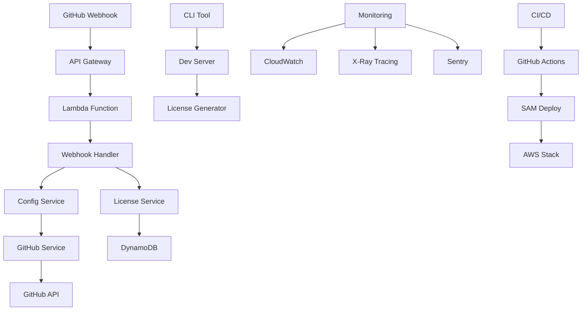

# Automerge-Pro: Enterprise GitHub App

[](https://github.com/MichaelWBrennan/KONIVRER-deck-database/actions/workflows/automerge-pro.yml)
[](LICENSE)
[](https://github.com/marketplace/automerge-pro)

**Automerge-Pro** is an enterprise-grade GitHub App that automates pull request management with intelligent rules, marketplace billing, and comprehensive monitoring. Built for teams that need reliable, scalable, and secure automated workflows.

## 🚀 Features

### Core Automation
- **Smart Auto-Merge**: Configurable rules based on status checks, reviews, labels, and more
- **Multiple Merge Strategies**: Support for merge commits, squash, and rebase
- **Conditional Logic**: Advanced rule conditions with priority-based execution
- **Branch Protection**: Integration with GitHub's branch protection rules

### Enterprise Features
- **GitHub Marketplace Integration**: Seamless billing with Free, Pro, and Enterprise tiers
- **License Validation**: Real-time license checking with feature gating
- **AWS Infrastructure**: Serverless deployment with Lambda, API Gateway, and DynamoDB
- **Multi-tenant Architecture**: Secure data isolation with RBAC

### Monitoring & Analytics
- **Real-time Monitoring**: CloudWatch integration with custom metrics
- **Error Tracking**: Comprehensive logging with Sentry integration
- **Performance Optimization**: Redis caching and cold start reduction
- **Audit Logging**: GDPR and SOC 2 compliant audit trails

### Developer Experience
- **CLI Tools**: Interactive setup, configuration validation, and development licensing
- **Visual Dashboard**: Web-based configuration and monitoring interface
- **Extensive Documentation**: OpenAPI specs with interactive examples
- **24/7 Support**: GitHub issue templates and automated support workflows

## 📦 Installation

### GitHub App Installation
1. Visit the [GitHub Marketplace](https://github.com/marketplace/automerge-pro)
2. Choose your billing plan (Free, Pro, or Enterprise)
3. Install on your repositories
4. Configure your `.automerge-pro.yml` file

### CLI Installation
```bash
# Install globally
npm install -g automerge-pro-cli

# Initialize in your repository
automerge-pro setup init --tier=pro --interactive

# Generate sample configuration
automerge-pro config generate --tier=enterprise -o .automerge-pro.yml
```

## ⚙️ Configuration

Create a `.automerge-pro.yml` file in your repository root:

```yaml
version: '2.0'

# Define merge rules with priorities
rules:
  - name: 'security-approved-merge'
    enabled: true
    priority: 95
    conditions:
      - 'label:security-approved'
      - 'status_checks_passed'
      - 'required_reviews_approved'
      - 'no_merge_conflicts'
    actions:
      - type: 'comment'
        value: 'Security review complete. Auto-merging... 🔒'
      - type: 'label'
        value: 'merged-by-automerge-pro'
      - type: 'merge'

  - name: 'feature-auto-merge'
    enabled: true
    priority: 70
    conditions:
      - 'base_branch:main'
      - 'status_checks_passed' 
      - 'required_reviews_approved'
      - '!draft'
    actions:
      - type: 'squash'

# Global merge conditions
conditions:
  required_status_checks: ['ci/build', 'ci/test', 'ci/security']
  required_reviews: 2
  dismiss_stale_reviews: true
  require_code_owner_reviews: true
  required_approving_review_count: 2
  allow_squash_merge: true
  allow_merge_commit: true
  allow_rebase_merge: false

# Notification settings (Pro+)
notifications:
  channels:
    - type: 'slack'
      endpoint: 'https://hooks.slack.com/services/YOUR/SLACK/WEBHOOK'
      events: ['merge_success', 'merge_failure', 'rule_triggered']
    - type: 'webhook'
      endpoint: 'https://your-api.com/automerge-notifications'
      events: ['all']
  
  events: ['pull_request_merged', 'pull_request_closed', 'status_check_failed']
  template: '🚀 PR #{number} "{title}" merged via rule "{rule_name}" by {author}'
```

## 🏗️ Architecture



### Technology Stack
- **Runtime**: Node.js 18+ with TypeScript
- **Framework**: Express.js with @vendia/serverless-express
- **Infrastructure**: AWS Lambda, API Gateway, DynamoDB
- **GitHub Integration**: @octokit/app, @octokit/webhooks
- **Validation**: Joi schema validation with YAML parsing
- **Testing**: Jest with comprehensive mocks
- **CI/CD**: GitHub Actions with AWS SAM

## 🔒 Security & Compliance

### Security Features
- **End-to-End Encryption**: All webhook payloads verified with HMAC signatures
- **OAuth 2.0/OpenID Connect**: Secure authentication flows
- **IAM Least Privilege**: Minimal AWS permissions with role-based access
- **Automated Security Scanning**: Snyk, CodeQL, and Dependabot integration

### Compliance
- **GDPR Ready**: Data processing transparency with audit logs
- **SOC 2 Preparation**: Security controls and monitoring
- **WCAG 2.1**: Accessibility compliance for web interfaces
- **ISO 27001 Prep**: Information security management best practices

## 📊 Billing Tiers

| Feature | Free | Pro ($9/month) | Enterprise ($29/month) |
|---------|------|----------------|------------------------|
| Basic Auto-merge | ✅ | ✅ | ✅ |
| Status Checks | ✅ | ✅ | ✅ |
| Advanced Rules | ❌ | ✅ | ✅ |
| Custom Notifications | ❌ | ✅ | ✅ |
| Analytics Dashboard | ❌ | ✅ | ✅ |
| Custom Actions | ❌ | ❌ | ✅ |
| Audit Logging | ❌ | ❌ | ✅ |
| SSO Integration | ❌ | ❌ | ✅ |
| Priority Support | ❌ | ❌ | ✅ |

## 🛠️ Development

### Local Development
```bash
# Clone the repository
git clone https://github.com/MichaelWBrennan/KONIVRER-deck-database.git
cd KONIVRER-deck-database/automerge-pro

# Install dependencies
npm install

# Create environment file
cp .env.example .env
# Edit .env with your GitHub App credentials

# Start development server
npm run start:dev

# In another terminal, start CLI
npx automerge-pro dev --port 3000
```

### Testing
```bash
# Run all tests
npm test

# Run with coverage
npm run test:coverage

# Run tests in watch mode
npm run test:watch

# Generate development license
npx automerge-pro license generate -i 12345 -t enterprise
```

### Deployment
```bash
# Build the application
npm run build

# Deploy to development
npm run deploy:dev

# Deploy to production
npm run deploy:prod

# Package for SAM
npm run package
```

## 📚 API Documentation

### Webhook Endpoints
- `POST /webhook` - GitHub webhook handler
- `GET /health` - Health check endpoint
- `GET /validate-license/:id` - License validation

### Configuration Endpoints  
- `GET /config/sample/:tier` - Generate sample configurations
- `POST /config/validate` - Validate repository configuration

### Development Endpoints
- `POST /dev/generate-license` - Generate development licenses (dev only)

For complete API documentation, see the [OpenAPI Specification](docs/openapi.json).

## 📈 Monitoring & Analytics

### Real-time Metrics
- Pull request processing times
- Merge success/failure rates
- License validation performance
- API gateway response times

### Alerting
- Lambda function errors and throttles
- DynamoDB capacity warnings
- GitHub API rate limit notifications
- Security incident alerts

### Dashboards
Access monitoring dashboards at:
- **CloudWatch**: AWS Console → CloudWatch → Dashboards
- **Application Insights**: GitHub repository → Actions → Monitoring
- **Performance**: X-Ray service map and traces

## 🤝 Support & Contributing

### Getting Help
1. Check the [Documentation](docs/)
2. Search [Issues](https://github.com/MichaelWBrennan/KONIVRER-deck-database/issues)
3. Create a [New Issue](https://github.com/MichaelWBrennan/KONIVRER-deck-database/issues/new/choose)
4. Contact [Enterprise Support](mailto:support@automerge-pro.com) (Enterprise tier)

### Contributing
We welcome contributions! Please see our [Contributing Guide](CONTRIBUTING.md) for details.

### Community
- **Discord**: [Join our community](https://discord.gg/automerge-pro)
- **Twitter**: [@AutomergePro](https://twitter.com/AutomergePro)
- **LinkedIn**: [Company Page](https://linkedin.com/company/automerge-pro)

## 📄 License

This project is licensed under the MIT License - see the [LICENSE](LICENSE) file for details.

## 🙏 Acknowledgments

- GitHub for the amazing Apps and Marketplace platform
- AWS for reliable serverless infrastructure  
- The open-source community for excellent tooling and libraries
- KONIVRER project for providing the foundation and hosting

---

**Ready to automate your pull requests?** [Get started with Automerge-Pro today!](https://github.com/marketplace/automerge-pro)